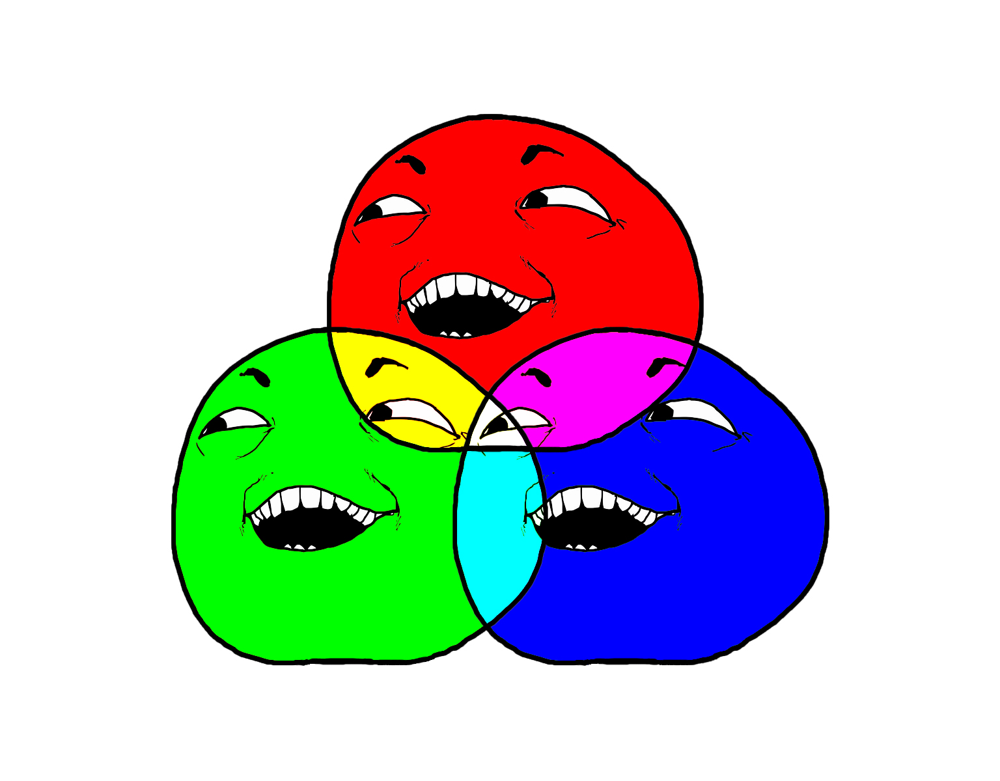

# Daily Coding Problem: Problem #35 [Hard]

````
From https://www.dailycodingproblem.com/

Good morning! Here's your coding interview problem for today.

This problem was asked by Google.

Given an array of strictly the characters 'R', 'G', and 'B', segregate the values of the array so that all the Rs come first, the Gs come second, and the Bs come last. You can only swap elements of the array.

Do this in linear time and in-place.

For example, given the array ['G', 'B', 'R', 'R', 'B', 'R', 'G'], it should become ['R', 'R', 'R', 'G', 'G', 'B', 'B'].
````

## Pseudocode

*L: Low, M: Middle, H: High*

* Always looking at M
* Distance between L - M - H always decreasing

````

L = 0

M = 0

H = arr.length - 1

While M <= H
    if M == "R"
        swap it with L
        increment M
        increment L
    else if M == "G"
        increment M
    else if M = "B"
        swap it with H
        decrement H
    end
end

````


## Output


````dtd
 G B R R B R G
 L            
 M            
             H

 G B R R B R G
 L            
   M          
             H

 G G R R B R B
 L            
   M          
           H  

 G G R R B R B
 L            
     M        
           H  

 R G G R B R B
   L          
       M      
           H  

 R R G G B R B
     L        
         M    
           H  

 R R G G R B B
     L        
         M    
         H    

 R R R G G B B
       L      
           M  
         H    

````

# Tests

see *com.rach.problem.thirtyfive*

# Other



